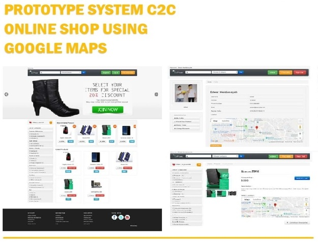

 

Prototype System C2C Online Shop is an
online site that acts as a third party whose
role is to connect sellers and buyers in
cyberspace or online. To make it easier for
buyers to find products, compare prices
and ease of transactions at the time of
product purchase and for sellers to facilitate
better product sales and promotions.

This system was added with the shop
address marking feature on google maps to
make it easier for buyers to visit the store's
address offline. 