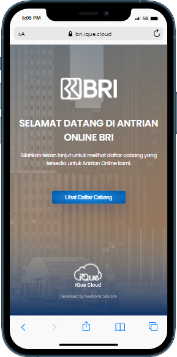

 

iQue is a complete queuing system used by companies or agencies that provide services. In this case a system that manages the customer's waiting experience throughout their journey, from pre-service to post-service. The solution may contain either or both software and hardware that helps the business to facilitate customer access to services, to plan and manage customer and staff flows, and to collect data to improve customer experience.

